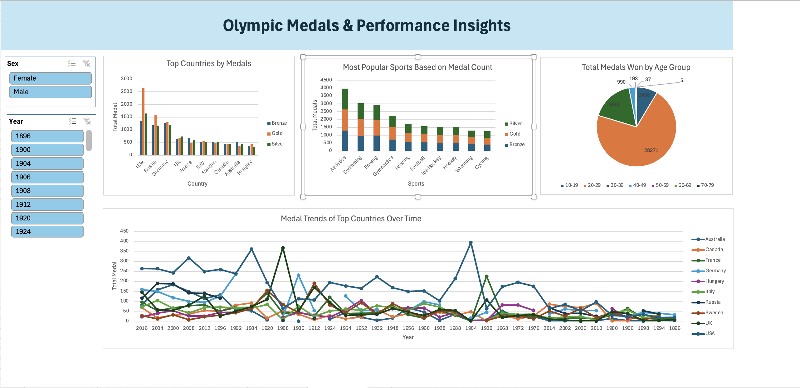

# Olympic Medals & Performance Insights

## Dataset

The dataset used in this project is obtained from [Kaggle: 120 Years of Olympics](https://www.kaggle.com/code/ridamahmood005/120-years-of-olympics-seaborn-plotly/input?select=athlete_events.csv). It contains data on Olympic athletes, including their participation, event results, and medal achievements.

### Columns in the Dataset:

The dataset contains the following columns:

- **Name**: Name of the athlete.
- **Sex**: Gender of the athlete (M or F).
- **Age**: Age of the athlete at the time of the event.
- **Height**: Height of the athlete.
- **Weight**: Weight of the athlete.
- **Team**: The team or country the athlete represents.
- **NOC**: National Olympic Committee (abbreviated form of the country).
- **Games**: The name of the Olympics (e.g., Summer, Winter).
- **Year**: The year the Olympics took place.
- **Season**: Whether the Olympics were held in Summer or Winter.
- **City**: The city where the Olympics were held.
- **Sport**: The sport the athlete participated in.
- **Event**: The specific event the athlete participated in.
- **Medal**: The type of medal won by the athlete (Gold, Silver, Bronze, or NA if no medal was awarded).

---

## Data Cleaning and Transformation

1. **Removing Duplicates**:  
   I started by removing any duplicate records to ensure the data was clean and accurate.

2. **Handling Missing Age Values**:  
   The **Age** column contained some missing (NA) values. Since age is important for visualizations and analysis, we replaced these missing values with the median age of the dataset.

3. **Standardizing Gender Values**:  
   In the **Sex** column, values such as "M" and "F" represented male and female, respectively. These were converted into full terms: "Male" and "Female" for better clarity in the analysis.

4. **Creating Age Range Column**:  
   An **Age Range** column was created to categorize athletes into specific age groups. This transformation allows us to analyze medal distribution by different age ranges.

5. **Converting Country Abbreviations to Full Names**:  
   The **NOC** (National Olympic Committee) column contains country abbreviations. To make the data more readable, these abbreviations were converted into full country names. This was done by merging the dataset with another dataset called **noc_regions** using a **VLOOKUP** function.

6. **Removing NA Values in Medal Column**:  
   The **Medal** column contains values of "NA" for athletes who did not win a medal. Since our analysis focuses on medal-winning athletes, we removed all rows with "NA" in the **Medal** column.

## Problem Statements

After the data cleaning and transformation steps, the following problem statements were addressed using the dataset:

1. **Problem 1: Identify the Top Countries by Medals**  
   How can we identify the countries that have won the most medals across all Olympic Games? This analysis helps us understand the leading nations in Olympic performance.

2. **Problem 2: Determine the Most Popular Sports Based on Medal Count**  
   Which sports have the highest number of medals awarded to athletes? By analyzing the medal counts across different sports, this problem aims to uncover the most popular sports in terms of Olympic success.

3. **Problem 3: Analyze Total Medals by Age Group**  
   How are medals distributed across different age groups? Using the newly created **Age Range** column, this problem explores the age distribution of medal-winning athletes and identifies patterns in medal performance based on age.

4. **Problem 4: Examine Medal Trends of Top Countries Over Time**  
   How has the medal count of top countries evolved over the years? This analysis examines the historical trends and patterns in Olympic performance by tracking how the top-performing countries’ medal counts have changed over time.

## Pivot Tables & Pivot Charts

The following pivot tables and charts were created to address the key problem statements, each with an appropriate chart type to visualize the data effectively:

1. **Top Countries by Medals**:  
   A pivot table was created to show the total number of medals won by each country. The data was visualized using a **clustered column chart** for clear comparisons.

2. **Most Popular Sports Based on Medal Count**:  
   A pivot table was created to analyze medal counts by sport. The data was visualized using a **stacked column chart** to show the contribution of each sport to the overall medal count.

3. **Medals by Age Group**:  
   A pivot table using the **Age Range** column was created to summarize total medals by age group. This data was visualized using a **pie chart** to represent the proportion of medals won by athletes in different age ranges.

4. **Medal Trends of Top Countries Over Time**:  
   A pivot table was created to track the medal trends of top-performing countries over the years. The data was visualized using a **line chart** to highlight the changes in medal counts across different Olympic Games.

## Dashboard

The **Dashboard** brings together all the pivot charts to provide a cohesive and interactive summary of the analysis:

- The **clustered column chart** (Top Countries by Medals), **stacked column chart** (Most Popular Sports Based on Medal Count), **pie chart** (Medals by Age Group), and **line chart** (Medal Trends of Top Countries Over Time) are grouped together for easy interpretation.
- **Gender** and **Year** slicers were added to allow users to filter and explore the data interactively, making the dashboard dynamic and user-friendly.

This dashboard provides a complete overview of the Olympic medal and performance insights, enabling better data-driven analysis.

## Insights

Based on the analysis of the Olympic dataset, the following key insights were observed:

1. **Top Countries by Medals**:

   - The United States leads the overall medal count, making it the top-performing country in Olympic history.

2. **Most Popular Sport**:

   - Athletics is the most popular sports category based on the number of medals won by athletes across all countries.

3. **Medals by Age Group**:

   - Athletes in the age group of **20-29** have won the highest number of medals, indicating this age range as the peak performance period for Olympians.

4. **Medal Trends of Top Countries Over Time**:
   - In the year **1896**, top-performing countries began with low medal counts due to the limited number of sports events at the time.
   - The United States showed an **exponential growth** compared to other nations in medal counts, peaking in year **1904** .
